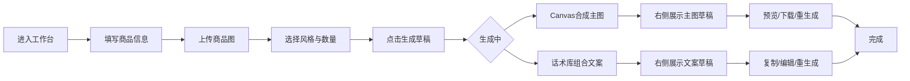

## 1. 产品概述

电商主图文案生成工作台 —— 帮助电商运营人员从繁琐的手动作图、写文案中解放出来。运营只需上传商品图、填写商品信息，系统即可自动批量生成主图草稿与营销文案草稿，运营挑选满意的稍作修改即可投入使用。
- 解决问题：运营手动逐个作图、写文案效率低下，质量参差不齐。
- 目标用户：电商店铺运营、美工、内容编辑。
- 产品价值：将主图与文案产出从"分钟级/件"压缩到"秒级/批"，让运营聚焦于挑选与微调。

## 2. 核心功能

### 2.1 用户角色
| 角色 | 注册方式 | 核心权限 |
|------|----------|----------|
| 运营人员 | 免登录直接使用 | 上传商品信息、生成草稿、预览、下载、复制文案 |

> MVP 版本为单用户本地工具，无需账号体系。

### 2.2 功能模块
1. **工作台首页（唯一页面）**：左侧商品信息输入区 + 右侧草稿生成结果区 + 顶部操作栏。

### 2.3 页面详情
| 页面名称 | 模块名称 | 功能描述 |
|----------|----------|----------|
| 工作台 | 顶部操作栏 | Logo、工具名、一键清空、生成按钮 |
| 工作台 | 左侧商品信息输入区 | 商品图上传（支持拖拽/点击，多图）、商品名称、核心卖点（多条）、价格、类目选择、风格选择（促销/简约/国潮/科技）、生成数量控制 |
| 工作台 | 右侧主图草稿区 | 网格展示生成的主图缩略图，点击放大预览，单张下载，重新生成单张 |
| 工作台 | 右侧文案草稿区 | 多条文案卡片，每条可一键复制、可编辑、可重新生成 |
| 工作台 | 状态反馈区 | 生成中加载动画、空状态提示、生成完成提示 |

## 3. 核心流程

运营进入工作台 → 在左侧填写商品名称、卖点、价格，上传商品图 → 选择风格与生成数量 → 点击"生成草稿" → 系统基于模板与 Canvas 合成主图、基于话术库组合文案 → 右侧分两栏展示主图草稿与文案草稿 → 运营点击主图放大预览/下载，点击文案复制/编辑 → 完成挑选与微调。

## 4. 用户界面设计

### 4.1 设计风格
- **整体定位**：现代专业的工作台美学，明亮、高效、有秩序感，避免花哨。
- **主色**：珊瑚橙 `#FF5A3C`（电商活力感）作为强调色，用于生成按钮、选中态、关键操作。
- **辅助色**：深石板 `#1A1D2E`（文字/侧栏）、浅雾灰 `#F5F6F8`（背景）、纯白卡片 `#FFFFFF`。
- **字体**：标题用 "Smiley Sans" 或 "Noto Serif SC"（中文有质感），正文用 "Noto Sans SC"。数字与价格用等宽 "JetBrains Mono"。
- **按钮风格**：主按钮实心珊瑚橙带轻微阴影，次按钮线性描边，圆角 8px。
- **布局风格**：双栏工作台（左输入 380px 固定 / 右结果自适应），顶部 64px 操作栏，整体卡片化分组。
- **图标风格**：线性图标（Lucide 风格），1.5px 描边，圆润端点。

### 4.2 页面设计概览
| 页面名称 | 模块名称 | UI 元素 |
|----------|----------|----------|
| 工作台 | 顶部操作栏 | 左侧 Logo+工具名，右侧"清空"线框按钮 + "生成草稿"实心珊瑚橙按钮，底部 1px 分割线 |
| 工作台 | 左侧输入区 | 白色卡片堆叠：上传卡片（虚线边框拖拽区）、基础信息卡片（商品名/价格/类目）、卖点卡片（多条可增删）、风格选择卡片（标签 chips）、生成数量滑块 |
| 工作台 | 右侧结果区 | 上方主图草稿网格（2-3列，圆角卡片，hover 显示下载/重生成浮层），下方文案草稿列表（卡片式，每条带复制/编辑/重生成图标） |
| 工作台 | 空状态 | 居中插画 + "填写左侧信息后生成草稿" 提示文字 |
| 工作台 | 加载态 | 生成按钮变加载态，结果区骨架屏闪烁 |

### 4.3 响应式
- 桌面优先（≥1280px 双栏并排）。
- 中等屏（768-1280px）保持双栏，左栏压缩至 320px。
- 移动端（<768px）改为上下堆叠，输入区在上、结果区在下，操作栏简化。

### 4.4 3D 场景指引
> 本项目无 3D 场景需求。
