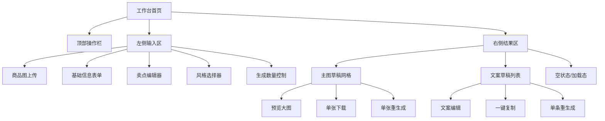
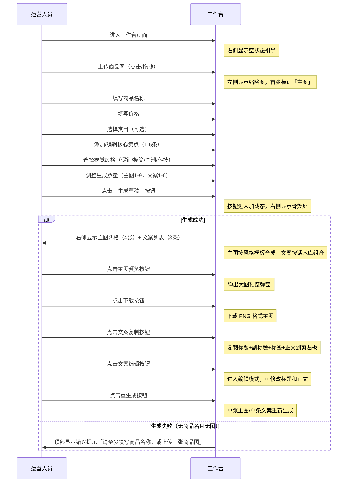
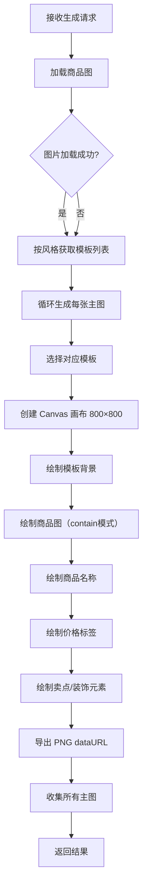

# 电商主图文案生成工作台 — 业务逻辑文档

## 1. 业务背景与价值

### 1.1 问题痛点
电商运营日常工作中，商品上架前需要完成「主图制作」和「文案撰写」两件核心工作。当前流程：
- **主图制作**：运营提供商品图 → 美工根据活动主题设计模板 → 手动合成主图 → 反复沟通修改 → 导出成品（平均每件商品耗时 15-30 分钟）
- **文案撰写**：运营结合商品卖点、活动力度、营销话术手动编写标题/副标题/正文 → 反复斟酌修改（平均每件商品耗时 5-10 分钟）
- **痛点汇总**：人工效率低、风格不统一、依赖美工资源、活动高峰时产能不足、修改反馈周期长

### 1.2 解决方案
构建「电商主图文案生成工作台」，运营只需输入商品基础信息，系统自动批量生成多风格草稿，运营挑选满意的稍作微调即可投入使用。

### 1.3 产品价值
- **效率提升**：从「分钟级/件」压缩到「秒级/批」，单次生成 4 张主图 + 3 条文案仅需 2-3 秒
- **质量保障**：统一模板库 + 话术库，确保风格一致、话术专业
- **降低依赖**：运营无需等待美工，可自行完成草稿产出
- **灵活微调**：支持单张重生成、文案编辑、一键复制/下载

## 2. 目标用户与使用场景

### 2.1 用户角色
| 角色 | 典型画像 | 核心需求 |
|------|----------|----------|
| 电商运营 | 负责店铺商品上架、活动策划、内容运营 | 快速产出主图文案草稿，应对频繁上新和活动 |
| 美工/设计师 | 负责最终视觉优化 | 参考系统生成的草稿进行二次创作，提高效率 |
| 内容编辑 | 负责商品详情页内容 | 获取专业营销文案，减少构思时间 |

### 2.2 使用场景
1. **日常上新**：新品上架前，快速生成主图草稿，挑选后交给美工微调
2. **活动备战**：大促活动前，批量生成多风格主图，选择最符合活动氛围的版本
3. **文案参考**：获取专业营销话术作为灵感，编辑后用于详情页或直播脚本
4. **风格测试**：同一商品尝试不同风格（促销/简约/国潮/科技），测试点击率

## 3. 功能架构

### 3.1 功能模块总览


### 3.2 功能详细说明

#### 3.2.1 商品图上传
- **触发方式**：点击上传区域 / 拖拽文件到上传区域
- **支持格式**：JPG、PNG、GIF（静态）
- **限制**：单张不超过 10MB，建议尺寸 800×800 以上（正方形）
- **多图支持**：可上传多张，首张自动标记为「主图」用于合成
- **操作**：预览缩略图、删除已上传图片

#### 3.2.2 基础信息表单
| 字段 | 类型 | 必填 | 约束 | 说明 |
|------|------|------|------|------|
| 商品名称 | 文本输入 | 建议填写 | 最大 30 字符 | 用于主图标题和文案中 {name} 占位符填充 |
| 价格 | 数字输入 | 可选 | 仅数字和小数点 | 用于主图价格展示和文案中 {price} 占位符填充 |
| 类目 | 下拉选择 | 默认值 | 8 个选项 | 用于文案语境优化，不影响主图生成 |

#### 3.2.3 卖点编辑器
- **多条管理**：支持 1-6 条卖点，可增删
- **文案模板**：每行提供占位提示（如"新疆长绒棉 亲肤透气"）
- **填充规则**：生成时随机选择一条非空卖点填入 {point} 占位符

#### 3.2.4 视觉风格选择
| 风格 | 适用场景 | 视觉特征 |
|------|----------|----------|
| 促销爆品 | 大促活动、清仓、秒杀 | 高饱和珊瑚橙渐变背景、价格放大、紧迫感文案 |
| 极简质感 | 日常上架、品牌调性、轻奢 | 留白充足、米色/白色背景、衬线字体、品质感 |
| 国潮东方 | 传统节日、国货品牌、文化主题 | 深色背景、金色边框、印章元素、书法字体 |
| 科技未来 | 数码产品、电子产品、3C | 深色渐变、霓虹发光、网格线条、参数感文案 |

#### 3.2.5 生成数量控制
- **主图草稿**：1-9 张（默认 4 张），按模板轮询分配
- **文案草稿**：1-6 条（默认 3 条），随机组合话术库模板

#### 3.2.6 主图草稿网格
- **展示方式**：响应式网格（移动端 2 列，桌面端 3 列）
- **交互操作**：hover 显示浮层按钮组（预览、下载、重生成）
- **预览弹窗**：点击预览按钮打开大图弹窗，支持下载和关闭

#### 3.2.7 文案草稿列表
- **展示内容**：标题、副标题、营销标签、正文
- **交互操作**：编辑标题/正文、一键复制（含全部内容）、单条重生成
- **编辑模式**：点击编辑按钮进入可编辑状态，标题输入框 + 正文文本域

## 4. 业务流程

### 4.1 完整用户流程


### 4.2 主图生成流程（后端/引擎）


### 4.3 文案生成流程（后端/引擎）
```mermaid
flowchart TD
    A[接收生成请求] --> B[按风格获取话术库]
    B --> C[循环生成每条文案]
    C --> D[随机选择标题模板]
    D --> E[随机选择副标题模板]
    E --> F[随机选择3个营销标签]
    F --> G[随机选择正文模板]
    G --> H[填充占位符]
    H --> I[替换 {name} 为商品名]
    I --> J[替换 {point} 为随机卖点]
    J --> K[替换 {price} 为价格]
    K --> L[替换 {category} 为类目]
    L --> M[组合成完整文案]
    M --> N[收集所有文案]
    N --> O[返回结果]
```

## 5. 数据模型

### 5.1 商品输入数据
```typescript
interface ProductInput {
  images: string[];           // 商品图 base64 数组，[0] 为主图
  name: string;               // 商品名称
  price: string;              // 价格（字符串格式）
  category: string;           // 类目
  sellingPoints: string[];    // 核心卖点数组
  style: 'promo' | 'minimal' | 'national' | 'tech';  // 视觉风格
  mainImageCount: number;     // 主图生成数量（1-9）
  copyCount: number;          // 文案生成数量（1-6）
}
```

### 5.2 生成结果数据
```typescript
interface GeneratedDraft {
  mainImages: MainImageDraft[];
  copies: CopyDraft[];
}

interface MainImageDraft {
  id: string;           // 唯一标识
  dataUrl: string;      // Canvas 导出的 PNG base64
  templateId: string;   // 使用的模板 ID
}

interface CopyDraft {
  id: string;           // 唯一标识
  title: string;        // 主标题
  subtitle: string;     // 副标题/卖点描述
  tags: string[];       // 营销标签（3个）
  text: string;         // 完整正文
}
```

### 5.3 主图模板结构
```typescript
interface MainImageTemplate {
  id: string;                              // 模板唯一标识
  name: string;                            // 模板名称
  style: 'promo' | 'minimal' | 'national' | 'tech';  // 所属风格
  draw: (ctx, product, image) => void;     // Canvas 绘制函数
}
```

### 5.4 文案话术库结构
```typescript
interface CopyPattern {
  titleTemplates: string[];        // 标题模板数组（含 {name} {point} 等占位符）
  subtitleTemplates: string[];     // 副标题模板数组
  tagPool: string[];               // 营销标签池
  bodyTemplates: string[];         // 正文模板数组
}
```

## 6. 状态管理

### 6.1 全局状态
```typescript
interface WorkbenchState {
  input: ProductInput;       // 当前输入数据
  result: GeneratedDraft | null;   // 生成结果
  isGenerating: boolean;     // 是否正在生成中
  previewImage: string | null;    // 当前预览的主图
  error: string | null;      // 错误信息
}
```

### 6.2 状态变更操作
| 操作 | 触发时机 | 状态变更 |
|------|----------|----------|
| updateInput | 输入框内容变化 | 更新 input 对应字段 |
| addImage | 上传图片成功 | input.images 添加新元素 |
| removeImage | 删除图片 | input.images 移除指定元素 |
| addSellingPoint | 点击添加卖点 | input.sellingPoints 添加空字符串 |
| removeSellingPoint | 删除卖点 | input.sellingPoints 移除指定元素 |
| updateSellingPoint | 卖点输入变化 | 更新对应卖点内容 |
| clearAll | 点击清空按钮 | 重置为默认状态 |
| generate | 点击生成按钮 | isGenerating=true，成功后设置 result |
| regenerateMainImage | 点击单张重生成 | 更新 result.mainImages 对应项 |
| regenerateCopy | 点击单条重生成 | 更新 result.copies 对应项 |
| updateCopyText | 编辑文案正文 | 更新 result.copies 对应项的 text |
| updateCopyTitle | 编辑文案标题 | 更新 result.copies 对应项的 title |
| setPreviewImage | 点击预览按钮 | 设置 previewImage |
| clearError | 点击错误提示的忽略 | 清除 error |

## 7. 错误处理与边界情况

### 7.1 输入校验
| 场景 | 校验规则 | 提示信息 |
|------|----------|----------|
| 无商品名且无图 | 商品名称为空 && 图片数组为空 | "请至少填写商品名称，或上传一张商品图" |
| 价格非数字 | 正则校验，仅允许数字和小数点 | 自动过滤非数字字符 |
| 卖点过多 | 超过 6 条 | 禁用添加按钮 |
| 图片格式错误 | 非 image/* 类型 | 自动忽略该文件 |

### 7.2 生成异常
| 场景 | 处理方式 |
|------|----------|
| Canvas 上下文不可用 | 抛出错误，顶部显示"生成失败，请稍后重试" |
| 图片加载失败 | 跳过图片绘制，使用灰色占位背景 |
| 生成过程中断 | 标记 isGenerating=false，保留已有结果 |

### 7.3 交互异常
| 场景 | 处理方式 |
|------|----------|
| 复制到剪贴板失败 | 回退到 execCommand 方式，仍失败则静默忽略 |
| 下载按钮点击无响应 | 检查 dataURL 是否有效，无效则不触发下载 |

## 8. 性能优化

### 8.1 前端优化策略
1. **Canvas 离屏渲染**：主图生成在离屏 Canvas 完成，避免阻塞主线程
2. **批量并行生成**：多张主图并行生成（Promise.all），提高速度
3. **图片懒加载**：主图缩略图按需加载
4. **字体预加载**：通过 FontFace API 或 Google Fonts 预加载中文字体
5. **状态缓存**：使用 localStorage 缓存最近一次输入（可选扩展）

### 8.2 生成速度目标
- 单次生成（4 主图 + 3 文案）：≤ 3 秒
- 单张主图生成：≤ 800ms
- 单条文案生成：≤ 50ms

## 9. 扩展性设计

### 9.1 模板扩展
- **新增风格**：在 `templates/` 目录新增风格文件，注册到 `index.ts`
- **新增模板**：在对应风格文件中添加新的模板对象
- **文案扩展**：在 `copyLibrary.ts` 中新增模板或标签

### 9.2 功能扩展方向
- 批量导出全部主图
- 保存历史记录
- 支持自定义模板上传
- 对接外部 AI 生图 API（如 DALL-E、Stable Diffusion）
- 支持多语言文案生成
- 添加水印功能
- 支持自定义尺寸输出

---

**文档版本**：v1.0 MVP  
**创建日期**：2026-07-15  
**适用场景**：单页面应用开发、AI IDE 代码生成提示词参考
