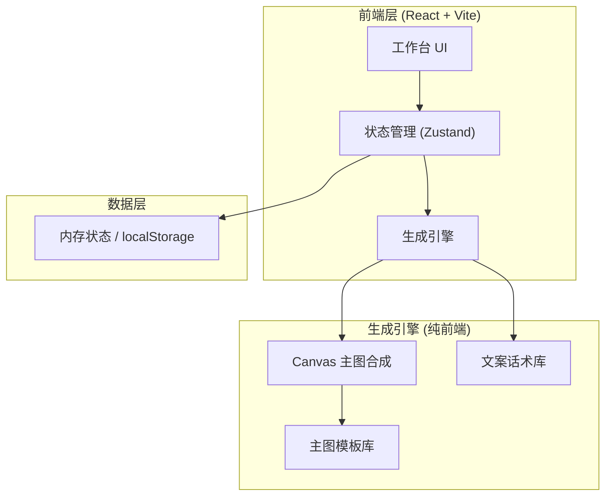

## 1. 架构设计



> MVP 为纯前端单页应用，无后端、无数据库、无外部 AI 服务。主图通过 Canvas 2D 合成（商品图 + 模板背景 + 文案叠加），文案通过本地话术库模板组合生成。保证零依赖外部服务即可运行。

## 2. 技术说明
- **前端框架**：React@18 + Vite@5
- **样式方案**：TailwindCSS@3
- **状态管理**：Zustand（轻量，适合单页工作台）
- **图标库**：lucide-react
- **字体**：Noto Sans SC / Noto Serif SC（Google Fonts）
- **初始化工具**：vite-init（react-ts 模板）
- **后端**：无
- **数据库**：无（仅内存与 localStorage 缓存最近一次输入）

## 3. 路由定义
| 路由 | 用途 |
|------|------|
| `/` | 工作台首页（唯一页面，含输入区与结果区） |

## 4. API 定义
> 无后端，无 API。所有生成逻辑在前端完成。

### 4.1 前端核心模块接口
```typescript
// 商品信息输入
interface ProductInput {
  images: string[];          // base64 图片数组
  name: string;              // 商品名称
  price: string;             // 价格
  category: string;          // 类目
  sellingPoints: string[];   // 核心卖点
  style: 'promo' | 'minimal' | 'national' | 'tech'; // 风格
  mainImageCount: number;    // 主图生成数量
  copyCount: number;         // 文案生成数量
}

// 生成结果
interface GeneratedDraft {
  mainImages: MainImageDraft[];
  copies: CopyDraft[];
}

interface MainImageDraft {
  id: string;
  dataUrl: string;           // Canvas 合成的图片 base64
  templateId: string;        // 使用的模板 id
}

interface CopyDraft {
  id: string;
  title: string;             // 主标题
  subtitle: string;          // 副标题/卖点描述
  tags: string[];            # 营销标签
  text: string;              // 完整文案
}

// 生成函数
async function generateDrafts(input: ProductInput): Promise<GeneratedDraft>
```

## 5. 服务端架构图
> 无后端，省略。

## 6. 数据模型
> 无持久化数据库。运行时数据为 React state 与 localStorage 缓存。

### 6.1 主图模板结构（前端静态资源）
```typescript
interface MainImageTemplate {
  id: string;
  name: string;              // 模板名称
  style: ProductInput['style'];
  width: number;             // 800
  height: number;            // 800
  bg: string;                // 背景色/渐变
  draw: (ctx, product, image) => void; // Canvas 绘制函数
}
```

### 6.2 文案话术库结构（前端静态资源）
```typescript
interface CopyPattern {
  style: ProductInput['style'];
  titleTemplates: string[];    // 标题模板，含 {name} {point} 占位
  subtitleTemplates: string[]; // 副标题模板
  tagPool: string[];           // 标签池
  bodyTemplates: string[];     // 正文模板
}
```
